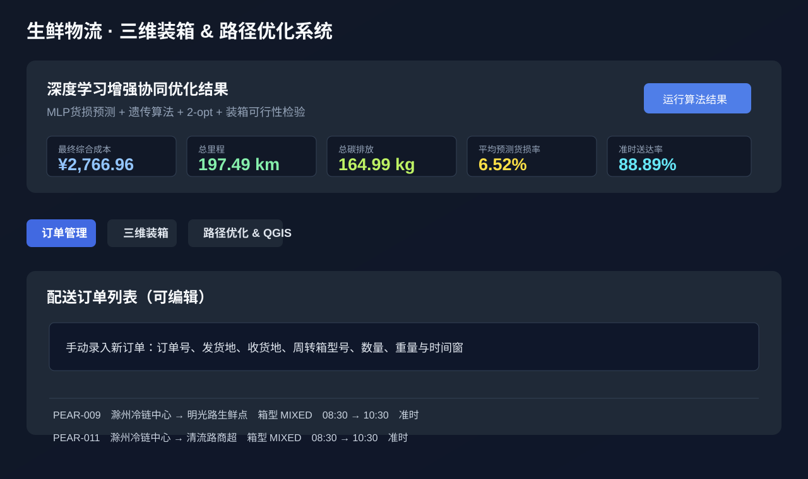
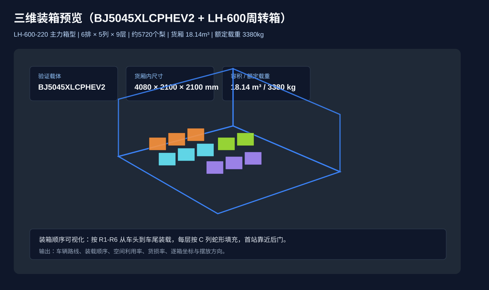
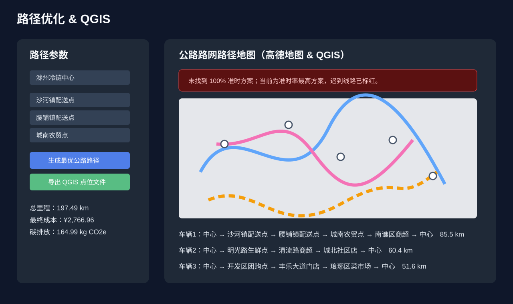

# 生鲜物流 · 三维装箱 & 路径优化系统


面向生鲜梨冷链配送全流程的协同优化系统。项目把 **三维装箱、车辆路径、货损预测、碳排放核算、时间窗履约** 放入同一套决策框架，避免单独优化路线或单独校验装箱导致整体方案不可执行。

> Fresh cold-chain collaborative optimization system with 3D bin packing, route planning, loss prediction, carbon accounting, and delivery time-window evaluation.

## 运行效果

| 订单与指标总览 | 三维装箱可视化 | 路径优化与 QGIS |
| --- | --- | --- |
|  |  |  |

截图对应系统中的三个核心工作台：订单录入与 KPI 汇总、BJ5045XLCPHEV2 冷藏车三维装箱预览、公路路网路径与 QGIS 导出。

## 项目亮点

- **一体化优化**：不是只做最短路径，而是同步考虑装箱、时间窗、货损、碳排放和执行可达性。
- **四箱型标准**：统一使用 `LH-600-140 / 220 / 300 / 340`，覆盖精品梨、常规梨、大批量硬果等场景。
- **三维装箱输出**：按 R/C/H 坐标输出箱体位置，支持装箱顺序、卸货顺序和空间利用率展示。
- **路径与履约评估**：输出车辆路径、预计抵达、迟到风险、准时率和 QGIS 兼容 GeoJSON。
- **绿色物流核算**：把行驶排放、制冷补偿、开门时间统一折算为 `CarbonCost`。
- **多端源码**：包含单页演示、Vue 管理端、FastAPI 后端和 Electron 桌面启动器。

## 算法口径

系统方法以 Word 方案中的 `MLP 货损预测 + GA-2-opt 路径优化 + 三维装箱可行性检验 + CarbonCost 绿色物流核算` 为准。

```text
F = C_transport + C_refrigeration + C_loss + C_carbon + P_time + P_pack
```

核心约束：

- `OnTimeRate >= 95%`，强制时间窗站点不得迟到。
- 车辆毛重不超过 3380 kg，建议运行上限不超过 3210 kg。
- 顶部通风余量不低于 150 mm。
- AABB 碰撞检测不允许箱体重叠。
- 支撑率：140/220 箱型不低于 85%，300 不低于 90%，340 不低于 95%。

完整算法说明见 [docs/algorithm/OPEN_SOURCE_ALGORITHM.md](docs/algorithm/OPEN_SOURCE_ALGORITHM.md)。

## 仓库结构

```text
web-demo/
  生鲜物流1.0.html                 单文件网页演示，可直接用浏览器打开

cold-chain-platform/
  backend/                         FastAPI 后端、优化服务、数据库模型和测试
  frontend/                        Vue 3 前端管理台和司机端页面
  desktop/                         Electron 桌面启动器源码
  infra/                           PostgreSQL 初始化和部署相关文件
  docs/                            平台算法、部署和展示材料
  tools/                           报告生成、Docker 检查等辅助脚本

docs/
  assets/                          GitHub README 运行效果图
  algorithm/                       开源算法逻辑说明
  design/                          软件需求、系统架构与数据库设计文档
  PROMOTION.md                     项目推广文案与发布建议
```

## 快速开始

### 1. 打开单页演示

直接用浏览器打开：

```text
web-demo/生鲜物流1.0.html
```

如果需要启用高德地图路径功能，请在 HTML 中填入自己的高德地图 Key 和安全密钥。

### 2. 启动完整平台

```powershell
cd cold-chain-platform
Copy-Item .env.example .env
docker compose up --build
```

访问地址：

```text
前端：http://localhost:5173
后端：http://localhost:8000/docs
健康检查：http://localhost:8000/api/health
```

默认演示账号：

```text
管理员：admin / admin123
调度员：dispatcher / dispatch123
仓库员：warehouse / warehouse123
司机：driver / driver123
```

## 技术栈

| 层级 | 技术 |
| --- | --- |
| 前端 | Vue 3、TypeScript、Element Plus、Three.js、Vite |
| 后端 | FastAPI、SQLAlchemy、Alembic、PostgreSQL/SQLite |
| 桌面端 | Electron、Node.js |
| 优化服务 | MLP 货损预测、GA-2-opt 路径优化、网格蛇形三维装箱、AABB 校验 |
| 地图与导出 | 高德地图、QGIS GeoJSON |

## 适用场景

- 冷链物流课程设计、毕业设计、竞赛项目。
- 生鲜配送路径与装箱协同优化原型。
- 绿色物流、碳排放核算和时效履约展示。
- Vue + FastAPI + Electron 全栈项目学习。

## 开源范围

本仓库只包含源码、文档和演示页面，不包含 Windows 安装包、压缩包、`node_modules`、构建产物、本地数据库、备份数据和私有 `.env` 文件。

## Star 支持

如果这个项目对你的课程设计、物流优化学习或全栈项目实践有帮助，欢迎点一个 Star。你的 Star 会帮助项目被更多冷链物流、路径优化和三维装箱方向的同学看到。

## License

本项目采用 [MIT License](LICENSE) 开源。
